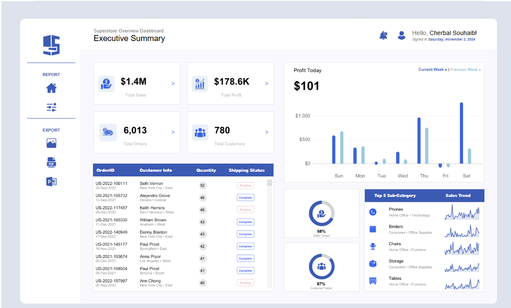

# Superstore Overview Dashboard

This Tableau project provides a comprehensive executive summary of key performance metrics for a superstore. The dashboard displays essential data, including total sales, profit, order count, and customer statistics, all visually organized to help users understand store performance and trends over time.

## Project Overview

This project aims to provide business insights through data visualization. The dashboard focuses on helping executives and decision-makers quickly interpret sales performance, customer engagement, and product popularity, aiding in strategic planning and operational optimization.

## Key Features

1. **Executive Summary**: Displays KPIs, including:
   - Total Sales
   - Total Profit
   - Total Orders
   - Total Customers

2. **Daily Profit Visualization**: A bar chart illustrating profit across the week.

3. **Order Details**: List of recent orders, including:
   - Order ID
   - Customer Info
   - Quantity
   - Shipping Status (Complete or Pending)

4. **Sales & Customer Targets**: Graphical representation of sales and customer target achievement.

5. **Top 5 Sub-Categories**: A breakdown of top-performing product sub-categories with sales trend data.

## Data Source

The dataset used for this project is based on a fictional superstore’s sales data, covering order details, customer demographics, product categories, and sales performance.

## Requirements

- **Tableau Desktop**: Required to view and interact with the `.twbx` file.

## Installation and Usage

1. **Clone this repository**:
   ```bash
   git clone https://github.com/yourusername/superstore-dashboard.git
   ```
   
2. **Open the Dashboard**:
   - Open Tableau Desktop.
   - Load the `Superstore Dashboard.twbx` file from the cloned repository.

## Screenshot

  
*(Replace with the correct path if necessary)*

## License

This project is licensed under the MIT License. See the [LICENSE](LICENSE) file for details.
